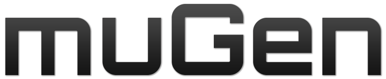
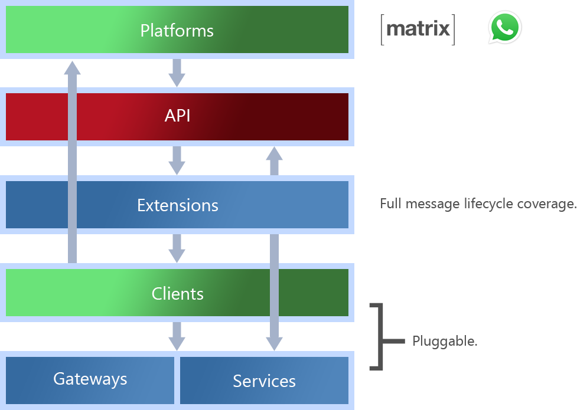

<p align="center">
    
</p>

# muGen - The GenAI Microframework

[](LICENSE.md)
[](https://github.com/vorsocom/mugen/releases/tag/0.43.0)


muGen (pronounced "mew-jen") is a [fair-code](https://faircode.io) licensed microframework for prototyping and deploying multimodal/multichannel (MM/MC or 3MC) Generative AI applications. Written in Python, muGen aims to have a simple, lean, and extensible codebase that allows developers to mix and match technologies and vendors—such as LLMs, vector storage, and communication platforms—to get from zero to deployment quickly. Read on for an overview of the framework, or skip ahead to our [quick start guide](#quick-start).

## Contents

1. [Architecture](#architecture)
2. [Quick Start Guide](#quick-start)
3. [Building Applications with muGen](#building-applications-with-mugen)
4. [License](#license)
5. [Why Source-Available](#why-source-available)
6. [Enterprise Services](#enterprise-services)

## Architecture

A muGen application consists of five layers, ranging from high-level platform interfaces to low-level core modules. These layers help maintain a [clean architecture](https://blog.cleancoder.com/uncle-bob/2012/08/13/the-clean-architecture.html), ensuring that dependencies always point towards lower layers. This approach increases flexibility, testability, and separation of concerns. Note, however, that clients which communicate with pull APIs and extensions which implement API endpoint will decrease "cleanliness".

<p align="center">
    
</p>

### Platforms

The platform layer includes communication platforms through which users interact with your application. These platforms can range from instant messaging services like Matrix and WhatsApp (currently supported by muGen core) to custom web applications. As muGen evolves, support for additional platforms will be added. A single muGen instance can handle multiple platforms concurrently, allowing for flexible multi-channel deployment.

### API

muGen runs on the same asyncio event loop as [Quart](https://palletsprojects.com/projects/quart), a Python web framework that supports asynchronous programming. This allows muGen to coexist with Quart and leverage its API-building functionality without being entirely dependent on it. The registration muGen's core API blueprint is delayed until extensions have been registered, enabling extensions to define custom endpoints or add routes to the core API seamlessly.


### Extensions

muGen supports various types of extensions, which can be platform-agnostic or specific, and are activated at different stages of the message lifecycle. The extensions allow developers to customize how the application behaves in response to user interactions. These extension types are:

1. **Framework (FW) Extensions:** These operate outside the message lifecycle, adding core functionalities like API endpoints. They are initialized during application startup.
2. **Inter-process Communication (IPC) Extensions:** These handle incoming requests to execute commands, enabling tasks such as running scheduled jobs and processing push API requests.
3. **Message Handler (MH) Extensions:** These manage non-text input, such as images or audio, and handle their processing within the system.
4. **Context (CTX) Extensions:** These provide additional context for the language model by injecting information into conversation histories.
5. **Retrieval Augmented Generation (RAG) Extensions:** These perform knowledge retrieval from external sources, enriching the language model's context with relevant information.
6. **Response Pre-processor (RPP) Extensions:** These modify the language model's responses before they are sent to the user, allowing for custom transformations.
7. **Conversational Trigger (CT) Extensions:** These detect specific cues in the final version of the language model's response and trigger operations based on those cues.

Extensions are built against object-oriented programming (OOP) style interfaces, not concrete implementations, and rely on dependency injection to interact with core modules. This design promotes flexibility and reusability.

### Clients

Clients provide platform-specific functionality and can be built for either push or pull APIs. Push API clients rely on IPC extensions to handle incoming requests. Configuration for the client modules is managed using a TOML configuration file, allowing for easy customization.

### Gateways and Services

Gateways and services form the core of muGen, providing platform-agnostic functionality such as communication with chat completion APIs, vector databases, and key-value storage. The naming convention distinguishes between:

- **Services:** Core functionality implemented within the framework.
- **Gateways:** Integrations with external libraries or systems.

The configuration for these modules is also managed using a TOML file, giving developers flexibility in selecting and configuring the services they need.

## Quick Start

To quickly set up and evaluate a muGen environment, follow these steps:

```bash
# Clone the main branch.
~$ git clone -b main --single-branch git@github.com:vorsocom/mugen.git

# Switch to the repository directory.
~$ cd mugen

# Create a Hypercorn config file in the root folder.
~$ echo 'bind = "127.0.0.1:8081"' > hypercorn.toml

# Copy the app configuration sample to the root folder.
~$ cp conf/mugen.toml.sample mugen.toml

# Edit mugen.toml to set your preferred values.
# At minimum, configure the completion gateway by
# setting mugen.modules.core.gateway.completion.
# Gateways are currently provided for AWS Bedrock,
# Groq, and SambaNova.
# For example, to use AWS Bedrock:
#   1. Set mugen.modules.core.gateway.completion to
#      "mugen.core.gateway.completion.bedrock".
#   2. Configure your AWS Bedrock credentials in the
#      [aws.bedrock] section.
~$ nano mugen.toml

# Install Python dependencies.
~$ poetry install

# Activate the Python environment.
~$ poetry shell

# Run the application.
~$ hypercorn -c hypercorn.toml quartman
```

You can now open a new terminal and connect to the running instance using Telnet:

```bash
~$ telnet localhost 8888
```

**Note:** The Telnet client is for **development use only** and should not be used in production environments.

## Building Applications with muGen

To start building, check out the guide on [building muGen applications](docs/apps.md).

## License

muGen is [fair-code](https://faircode.io), distributed under the [**Sustainable Use License**](LICENSE.md). For proprietary enterprise licenses, please [**request one**](mailto:license@vorsocomputing.com).

## Why Source-Available?

muGen began as a closed-source project. However, we realized that many clients prefer software that is open to public scrutiny and offers protection against consultancy lock-in. By making muGen source-available and adopting a fair-code license, we allow broader use of the framework in ways that do not harm our business objectives while increasing transparency.

## Enterprise Services

We provide enterprise support for building applications using muGen. Leverage our expertise to accelerate your project. [**Get in touch**](mailto:brightideas@vorsocomputing.com) to learn more or request a quote.