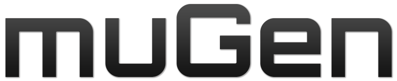

<p align="center">
    
</p>

# muGen: Python Framework for Multi-Channel AI Assistants and Agent Applications

[](LICENSE.md)
[](https://github.com/vorsocom/mugen/actions/workflows/test-gates.yml?query=branch%3Adevelop)
[](https://github.com/vorsocom/mugen/actions/workflows/release.yml)
[](https://github.com/vorsocom/mugen/releases)


muGen (pronounced "mew-jen") is a Python framework for building multi-tenant AI assistants and agent-backed applications that run across web and messaging channels. It is designed for teams that want one runtime for chat, web, retrieval, governance, and provider integration without hard-wiring the system to a single model vendor or transport.

At its core, muGen combines a multi-channel messaging runtime, an ACP-backed control plane, a provider-neutral context engine, and an optional agent runtime for durable background work. Read on for the high-level framework story, or jump straight to the [quick start](#quick-start).

## Why muGen

- **Build one assistant runtime for multiple channels.** muGen supports web chat plus messaging platforms from the same core runtime and extension model.
- **Keep tenant control and operations in the framework.** ACP-backed resources, actions, RBAC, runtime profiles, and admin APIs make multi-tenant control-plane concerns first-class.
- **Use retrieval and context without locking into one provider.** The context engine composes contributors, guards, rankers, caches, provenance, and writeback behind typed contracts.
- **Add agent behavior without replacing the core messaging path.** Routes can opt into an agent runtime that supports planning, evaluation, capability execution, and resumable background continuation.
- **Swap infrastructure through gateways.** Completion, knowledge, email, SMS, and storage surfaces are exposed through provider-neutral contracts.
- **Get durable transport behavior.** Web delivery includes queueing and SSE replay semantics, while supported messaging platforms share durable ingress, dedupe, retries, and dead-letter handling.

## Supported Channels

Core platform support is documented in [clients](docs/clients.md), the shared [messaging ingress contract](docs/messaging-ingress-contract.md), and the platform-specific support contracts.

| Channel | Current core surface |
| --- | --- |
| Web | Authenticated REST + SSE chat transport with queueing, replay, and tokenized media delivery |
| Matrix | DM-first transport with ACP-managed client profiles and shared ingress durability |
| LINE | Webhook ingress via shared durable ingress foundation |
| Signal | Shared durable ingress with account-scoped routing |
| Telegram | Webhook ingress via shared durable ingress foundation |
| WeChat | Webhook ingress via shared durable ingress foundation |
| WhatsApp | Webhook ingress via shared durable ingress foundation |

## Supported Providers

muGen uses strict provider tokens in config and exposes provider-neutral contracts for gateway integrations. See [gateways](docs/gateways.md) and [dependency injection](docs/dependency-injection.md) for the current runtime contract.

| Gateway category | Supported providers |
| --- | --- |
| Completion | AWS Bedrock, Azure AI Foundry, Cerebras, Groq, OpenAI, SambaNova, Vertex AI |
| Knowledge | ChromaDB, Milvus, Pinecone, pgvector, Qdrant, Weaviate |
| Email | Amazon SES, SMTP |
| SMS | Twilio |

## Architecture

muGen keeps the runtime split into a small number of explicit seams so web, messaging, context, agent execution, and provider integrations can evolve independently.

- **Platforms and transport:** web uses authenticated REST + SSE contracts, while Matrix, LINE, Signal, Telegram, WeChat, and WhatsApp share one durable ingress foundation for staging, dedupe, retries, and checkpoints.
- **ACP and framework extensions:** ACP-backed plugins expose tenant-scoped CRUD, actions, RBAC, runtime profiles, and admin APIs, while framework extensions register platform and feature surfaces during bootstrap.
- **Context engine:** the core messaging path prepares one normalized completion request through provider-neutral contributors, guards, rankers, caches, trace sinks, and post-turn commit behavior.
- **Agent runtime:** routes can optionally hand prepared turns to a dedicated agent runtime for plan-act-evaluate loops, capability execution, and durable background continuation.
- **Gateways and services:** completion, knowledge, email, SMS, and storage integrations stay behind typed contracts so providers can be swapped without rewriting the application boundary.

For the deeper runtime contracts, start with [services](docs/services.md), [context engine design](docs/context-engine-design.md), [agent runtime design](docs/agent-runtime-design.md), and [extensions](docs/extensions.md).

## Quick Start

### 1. Clone the repository and copy the sample config files

```bash
~$ git clone git@github.com:vorsocom/mugen.git
~$ cd mugen
~$ cp conf/hypercorn.toml.sample hypercorn.toml
~$ cp conf/mugen.toml.sample mugen.toml
```

### 2. Configure `mugen.toml`

At minimum:

- set `mugen.modules.core.gateway.completion` to your completion provider token;
- keep `mugen.modules.core.service.context_engine = "default"` unless you are intentionally swapping the runtime implementation;
- keep `mugen.runtime.profile = "platform_full"` unless you are intentionally using a different runtime profile;
- if `web` is enabled, keep the default web/runtime framework extensions enabled, including `core.fw.acp`, `core.fw.context_engine`, and `core.fw.web`;
- if `matrix` is enabled, set `security.secrets.encryption_key`.

Provider config values are strict tokens, not Python module paths. Current completion gateways include AWS Bedrock, Azure AI Foundry, Cerebras, Groq, OpenAI, SambaNova, and Vertex AI. For provider-specific config details, see [gateways](docs/gateways.md) and [dependency injection](docs/dependency-injection.md).

### 3. Install dependencies and activate the Poetry environment

```bash
~$ poetry install
~$ poetry shell
```

### 4. Apply migrations for enabled tracks

```bash
~$ python scripts/run_migration_tracks.py upgrade head
```

### 5. Start the application

```bash
~$ hypercorn -c hypercorn.toml quartman
```

Bootstrap lifecycle:

1. **Phase A (blocking):** load extensions and register API routes.
2. **Phase B (background):** start long-running platform clients such as Matrix, WhatsApp, or web workers.

The server does not begin serving requests until Phase A completes successfully.

### 6. Optional development harness

For local development and testing, you can run the telnet harness in a separate process:

```bash
~$ python -m mugen.devtools.telnet_harness
```

Then connect locally:

```bash
~$ telnet localhost 8888
```

The telnet harness is for development and testing only and is blocked in production.

## Read Next

- [Building muGen applications](docs/apps.md)
- [Downstream architecture conformance](docs/downstream-architecture-conformance.md)
- [Developing extensions](docs/extensions.md)
- [Working with gateways](docs/gateways.md)
- [Web platform support contract](docs/web-support-contract.md)
- [Working with services](docs/services.md)
- [ACP RBAC policy](docs/acp-rbac-policy.md)
- [Context engine design](docs/context-engine-design.md)
- [Context engine authoring](docs/context-engine-authoring.md)
- [Agent runtime design](docs/agent-runtime-design.md)
- [Agent runtime authoring](docs/agent-runtime-authoring.md)

## Release Automation

muGen includes a release automation script that mirrors the release workflow:

```bash
# On develop, prepare a release branch and run full gates.
poetry run python scripts/release.py prepare --bump patch --python "$(poetry run which python)"

# Finish release: open the release PR to main.
poetry run python scripts/release.py finish --version 0.43.3

# After the release PR is merged on main, tag it and open the develop sync PR.
# After that PR is merged, rerun publish to clean up the release branch.
poetry run python scripts/release.py publish --version 0.43.3
```

A manual GitHub Actions workflow is also available at `.github/workflows/release.yml`.

## License

muGen is [fair-code](https://faircode.io), distributed under the [**Sustainable Use License**](LICENSE.md). For proprietary enterprise licenses, please [**request one**](mailto:license@vorsocomputing.com).

## Why Source-Available?

muGen began as a closed-source project. We moved to a source-available model because many teams want public scrutiny, operational transparency, and protection against consultancy lock-in while still needing a sustainable licensing model for the framework.

## Enterprise Services

We provide enterprise support for teams building on muGen. If you need help with architecture, extensions, platform rollout, or provider integration, [get in touch](mailto:brightideas@vorsocomputing.com).
